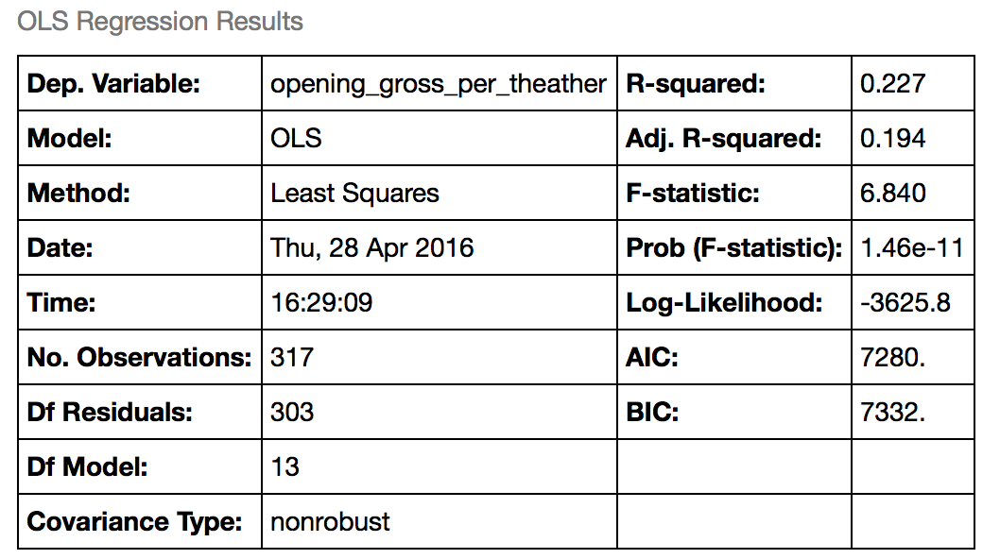
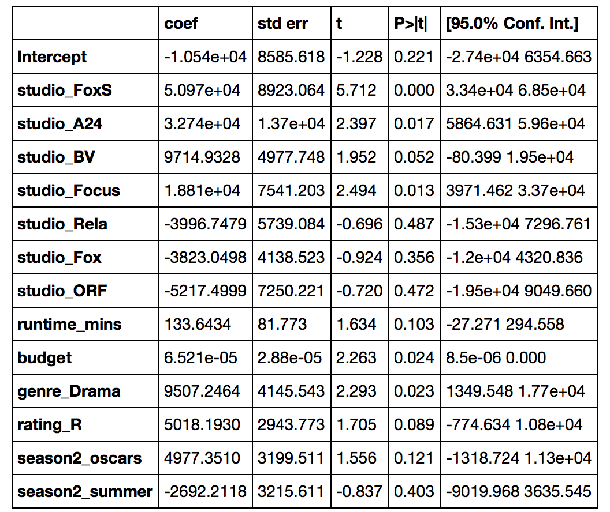

**Description:**

The goal of this project is to develop a model to help movie theaters estimate the   
opening gross profit for high budget movies.      
Movie theaters split gross profits with studios/distributors following an sliding scale.     
On average, movie theaters keep 50% of gross profits and studios collect the remainder 50%.    
However, for high budget movies, movie theaters can collect only 20% of gross profits    
during the first weeks after release.  Movie theaters need to decide which movies to play.  
If they decide to play major blockbusters, they keep a small percentage of profits  
during the first weeks.  On the other end, if they decide to play regular movies, they  
keep on average 50% since the beginning.  Major blockbusters might attract more viewers  
contributing to higher gross profits.

**Data**

Data source : Box Office Mojo
http://www.boxofficemojo.com  

This model includes historical data for 317 movies from 2012 to 2014. 

The model includes the following variables:  

Independent:  
* genre
* rating
* runtime 
* budget
* studios
* release date

Dependent:
* opening gross profit per theater (opening gross / opening theaters)

**Method**
Ordinary least square regression  

**Tools**
python (Beautiful soup for scraping).  
pandas (data cleaning and analysis)  
numpy  
statsmodel

**Model**  
  
  
  

   

